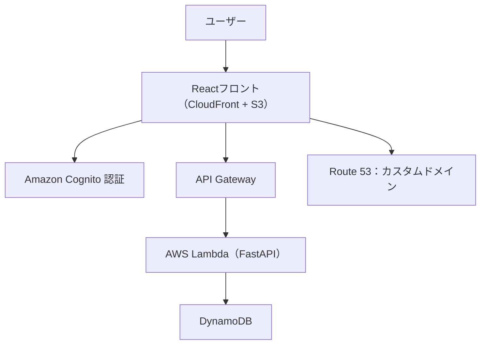
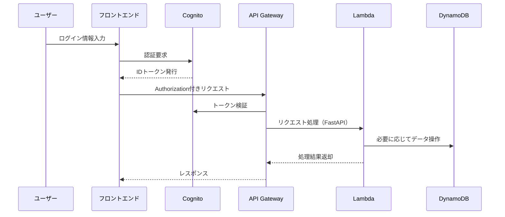

# 📝 AWS Webアプリケーション設計書

## 1. はじめに（目的）

本ドキュメントは、React + FastAPIで開発されたWebアプリケーションをAWS上へ移行するにあたり、その構成・処理フロー・セキュリティ対策について整理した設計書である。クラウド環境上での可用性、拡張性、保守性を考慮し、主要なAWSサービスを活用する。

---

## 2. システム構成概要

本システムは、以下のようなクラウドネイティブ構成で構築される：

| コンポーネント     | サービス構成                                 | 用途                             |
|------------------|------------------------------------------|----------------------------------|
| フロントエンド     | React + S3 + CloudFront + Route 53       | 静的ファイルの配信と独自ドメイン設定 |
| 認証認可         | Amazon Cognito                          | ユーザーのサインアップ、ログイン、トークン発行 |
| バックエンドAPI    | API Gateway + AWS Lambda (FastAPI)      | REST APIエンドポイント処理       |
| データベース      | Amazon DynamoDB                         | 永続的なデータストレージ           |
| ドメイン管理      | Route 53                                | 独自ドメインのDNS管理             |

---

## 3. アーキテクチャ図

---

## 4. 認証・通信フロー（Cognito + API Gateway）

---

## 5. 各処理詳細

### 5.1 フロントエンド（React）

- `npm run build`で生成された静的ファイルをS3へデプロイ
- CloudFrontを介して配信、Route 53でドメインを設定
- `aws-amplify`ライブラリでCognitoと連携し、ログイン・トークン取得処理を実装
- API呼び出し時にCognito IDトークンをHTTPヘッダーに付与

### 5.2 認証（Cognito）

- ユーザープールでサインアップ／ログインを管理
- JWTトークン（ID / Access / Refresh）を返却
- MFAやパスワードポリシーも設定可能（必要に応じて）

### 5.3 バックエンド（FastAPI on Lambda）

- FastAPIアプリケーションをLambda対応形式（`Mangum`ライブラリ）で変換
- API Gatewayでエンドポイントを定義
- リクエストに応じてDynamoDBへアクセス
- 必要に応じて例外処理・バリデーションを実装（Pydantic）

### 5.4 データベース（DynamoDB）

- 非リレーショナルなキー・バリュー形式の保存方式
- Lambda関数からBoto3で読み書き
- 利用例：ユーザー設定情報、ログ履歴、フォーム送信データなど

---

## 6. Lambda構成（例）

| 関数名         | 説明                     | トリガー       | ライブラリ             |
|--------------|------------------------|--------------|----------------------|
| `auth_handler` | 認証ユーザーのプロフィール取得     | API Gateway | `fastapi`, `boto3`, `mangum` |
| `data_submit`  | 入力フォームのデータ保存処理       | API Gateway | `fastapi`, `pydantic`, `boto3` |

---

## 7. エラーハンドリング方針

| ケース               | HTTPステータス | レスポンスメッセージ例         |
|--------------------|----------------|-----------------------------|
| トークン不正            | 401 Unauthorized | 認証に失敗しました              |
| 入力パラメータ不正        | 400 Bad Request   | 入力内容を確認してください         |
| 内部サーバーエラー        | 500 Server Error  | サーバーエラーが発生しました      |
| DBアクセス失敗         | 503 Service Unavailable | データベース接続に失敗しました  |

---

## 8. セキュリティ対策

- Cognitoによる認証（JWT + トークン失効期限の管理）
- API GatewayのIAM認証 / CORS制御
- Lambda実行ロールに最小限のIAM権限を付与（DynamoDB読み書きのみ）
- CloudFrontによるオリジン保護、HTTPS化
- WAFの導入（必要に応じて）

---

## 9. 今後の展望（Optional）

- CloudWatch Logsの導入と可視化
- CodePipelineでのCI/CD構成（自動S3デプロイ）
- DynamoDBのインデックスチューニング
- モニタリングツールの統合（例：Datadog）

---

## 10. 添付資料

- API仕様書（OpenAPI / Swagger形式）
- ER図（DynamoDBテーブル設計）
- Lambdaパッケージ構成例
